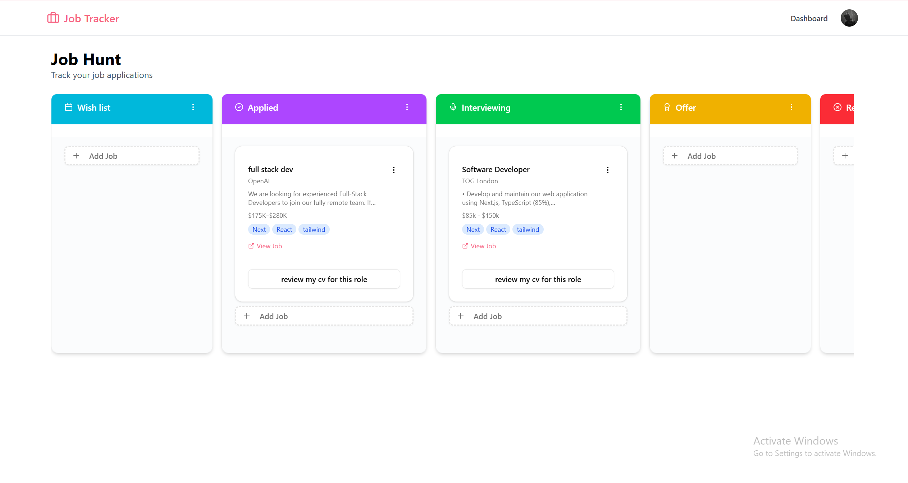
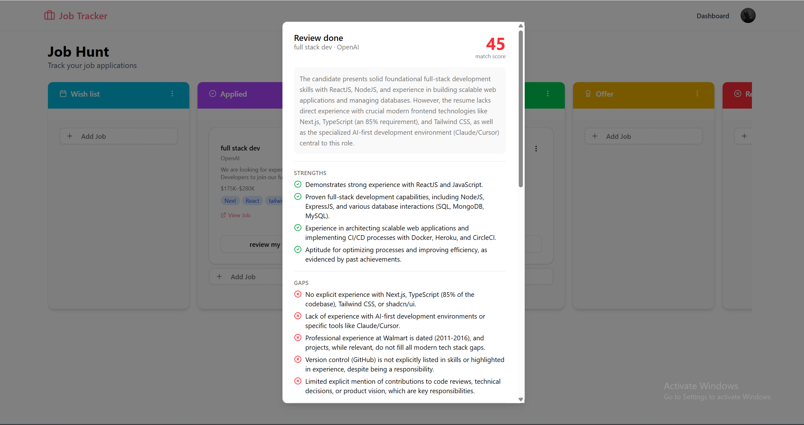
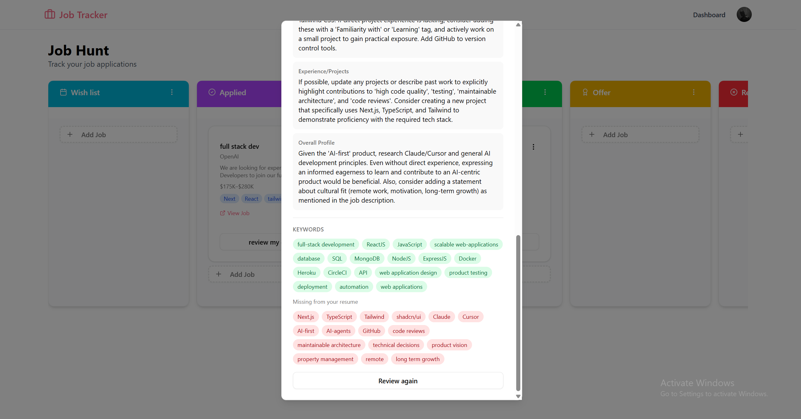

# Job Tracker 💼

A modern full-stack job tracking platform that helps users organize applications on a Kanban board and evaluate resume-job fit using AI-powered analysis.


## 🌐 Live Demo

https://job-application-tracker-seven-chi.vercel.app/

## 📸 Preview

[](https://youtu.be/qKSm3FQNiWQ)



| AI Resume Review | AI Resume Review |
|---|---|
|  |  |

## ✨ Features

- **Kanban Board** — Drag & drop job cards across 5 stages: Wish List → Applied → Interviewing → Offer → Rejected
- **AI Resume Review** — Upload your resume (PDF) and get a match score, keyword analysis, strengths, gaps, and suggestions powered by Gemini 2.5 Flash — per job card
- **Rate Limiting** — 5 AI reviews per user per day to prevent abuse
- **Authentication** — Email/password sign up with optional profile picture upload (Cloudinary)
- **Per-job Details** — Track company, position, location, salary, job URL, tags, description, and notes
- **Automatic Board Provisioning** — A default "Job Hunt" board with all 5 columns is created automatically on sign up

## 💡 Why I Built This

I wanted to build a project that combined real-world CRUD architecture, authentication, drag-and-drop UX, file uploads, and AI integration into one cohesive product. The goal was to simulate production-level patterns while solving a real problem for job seekers.

## 🛠 Tech Stack

| Layer | Technology |
|---|---|
| Framework | Next.js 16 (App Router) |
| Language | TypeScript 5 |
| Styling | Tailwind CSS v4 + shadcn/ui (New York) |
| Auth | Better Auth (email/password) |
| Database | MongoDB + Mongoose |
| AI | Google Gemini 2.5 Flash |
| File Storage | Cloudinary (avatars), unpdf (resume parsing) |
| Drag & Drop | @dnd-kit/core + @dnd-kit/sortable |
| Toasts | Sonner |

## 📁 Project Structure

```
├── app/
│   ├── api/
│   │   ├── auth/[...all]/     # Better Auth handler
│   │   ├── resume/            # Upload & fetch resume (PDF)
│   │   ├── resume-review/     # AI resume review (Gemini)
│   │   └── upload/            # Avatar upload (Cloudinary)
│   ├── dashboard/             # Kanban board page (protected)
│   ├── sign-in/
│   ├── sign-up/
│   └── page.tsx               # Landing page
├── components/
│   ├── kanban-board.tsx        # DnD Kanban with @dnd-kit
│   ├── job-application-card.tsx
│   ├── create-job-dialog.tsx
│   ├── review-resume-dialog.tsx  # AI review UI
│   ├── resume-upload.tsx
│   └── navbar.tsx
├── lib/
│   ├── actions/               # Next.js Server Actions
│   ├── auth/                  # Better Auth config
│   ├── models/                # Mongoose schemas
│   ├── hooks/useBoards.ts     # Optimistic drag-and-drop state
│   ├── init-user-board.ts     # Auto board creation on signup
│   ├── rate-limit.ts          # In-memory rate limiter
│   └── db.ts                  # Mongoose connection (cached)
└── scripts/seed.ts            # Dev seed script
```

## 🗄 Data Model

```
Board
  └── columns: [Column]
        └── jobApplications: [JobApplication]

UserProfile
  └── userId (string)
  └── resumeText (extracted from PDF)
  └── resumeFileName
```

## 🚀 Getting Started

### 1. Clone & Install

```bash
git clone https://github.com/your-username/job-tracker.git
cd job-tracker
npm install
```

### 2. Set up environment variables

Create a `.env.local` file in the root:

```env
# MongoDB
MONGODB_URI=mongodb+srv://<user>:<password>@cluster.mongodb.net/job-tracker

# Better Auth
BETTER_AUTH_SECRET=your-secret-here
NEXT_PUBLIC_BETTER_AUTH_URL=http://localhost:3000

# Google Gemini
GEMINI_API_KEY=your-gemini-api-key

# Cloudinary
CLOUDINARY_CLOUD_NAME=your-cloud-name
CLOUDINARY_API_KEY=your-cloudinary-key
CLOUDINARY_API_SECRET=your-cloudinary-secret
```

### 3. Run the dev server

```bash
npm run dev
```

Open [http://localhost:3000](http://localhost:3000).

### 4. (Optional) Seed sample data

```bash
# Edit scripts/seed.ts and set USER_ID to your user's MongoDB ID
npm run seed:jobs
```

## 🔑 Key Implementation Notes

- **Optimistic UI for drag & drop** — `useBoard` hook updates columns locally before the server action resolves, so drags feel instant
- **Session caching** — Better Auth uses `cookieCache` (1hr) to reduce DB calls on every request
- **PDF parsing** — `unpdf` extracts text client-side before storing; scanned/image PDFs are rejected early with a clear error
- **Rate limiting** — In-memory Map keyed by `userId`, resets every 24 hours. Note: resets on server restart (stateless)
- **Auto board init** — `databaseHooks.user.create.after` in Better Auth triggers `initializeUserBoard` on first sign up
